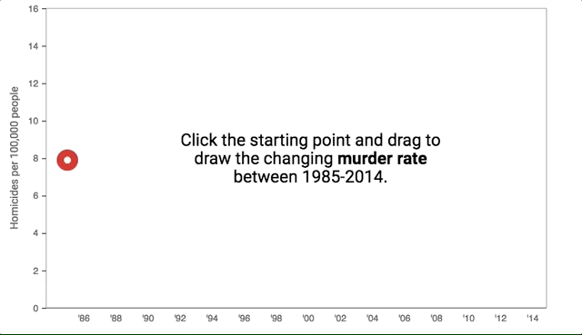

# Guess-Graph
Make simple line charts that challenge users to draw their best guess of a trend, and then show them the real data. 



## Why does this exist?
More details [here](), but simply put: *People suck at accepting information that challenges their pre-conceived ideas, and in a small way, interaction might help fix that.*

In 2016, I wrote a [story](https://www.theatlantic.com/politics/archive/2016/07/is-violence-in-america-going-up-or-down/491384/) for The Atlantic about how Americans believe crime is on the rise, even though the national homicide rate has declined for decades.

For the story, I made an interactive graphic that challenged readers to draw their guess at the national homicide rate over the last 20 years or so. When they finished, the graphic showed them the actual rate. My thought was that readers might buy into the story's conclusions a bit more if they had a hand in drawing a contrast between their beliefs and reality. 

Two and half years later, with immigration and the border wall in the news, I thought it might be useful to industrialize the graphic as a general-use web component. 

## Installation 
You can download guess-graph using `npm install guess-graph`. The library is also hosted at xxx-insert-cdn-here.


## Basic use
```
<script src="./node_modules/guess-graph/dist/bundle.js">
<guess-graph
  intro-title = "Click the starting point and 
    draw your best guess for total <strong>illegal 
    border crossings</strong> between 1997 and 2017."
  data = "border-arrests.json"
  y-axis-label = "Illegal border crossings (in millions)"
  y-axis-min = "0"
  y-axis-max = "3"
  height-mobile = "300"
  height = "400"
></guess-graph>
```

## Customization
Guess-graph offers a bunch of parameters to customize the interactive.
* `data` (required): A relative or absolute path to the JSON file containing the graphic's trendline data.
* `intro-title` (required): The text that's displayed before a user interacts with the graphic.
* `y-axis-label` (required): Label for the y-axis, displayed rotated 90deg on the left side.
* `y-axis-min`, `y-axis-max`: Minimum and maximum values to display on the y axis. This can be helpful to center a given starting point so your users aren't biased to a certain conclusion.
* `y-axis-ticks`, `x-axis-ticks`: If you'd rather specify the tick values yourself, use this property, separating values by commas like this: `2010,2012,2014`
* `x-axis-ticks-mobile`: Specify ticks for mobile displays, since the default might result in some squished-looking axes.
* `height`, `height-mobile`: Specify the desired height of the module on both desktop and mobile displays. The component assumes sensible defaults but sometimes you might want a deeper or shallower graphic depending on expected content width.
* `result-message`: Set to `true` if you want users to see a message scoring their accuracy after they draw their lines.
  
## Data format
Right now, the component needs you to format your data in a certain way and store it as JSON. (More flexibility coming soon!) Here's a sample:

```
[
  {
    "year": 1997,
    "rate": 1.369
  },
  {
    "year": 1998,
    "rate": 1.517
  },
  {
    "year": 1999,
    "rate": 1.537
  },
  ...
]
``` 

## Restrictions
The x-axis only accepts years as values, and formats them into the `'YY` format. So all trends have to be time series for now.